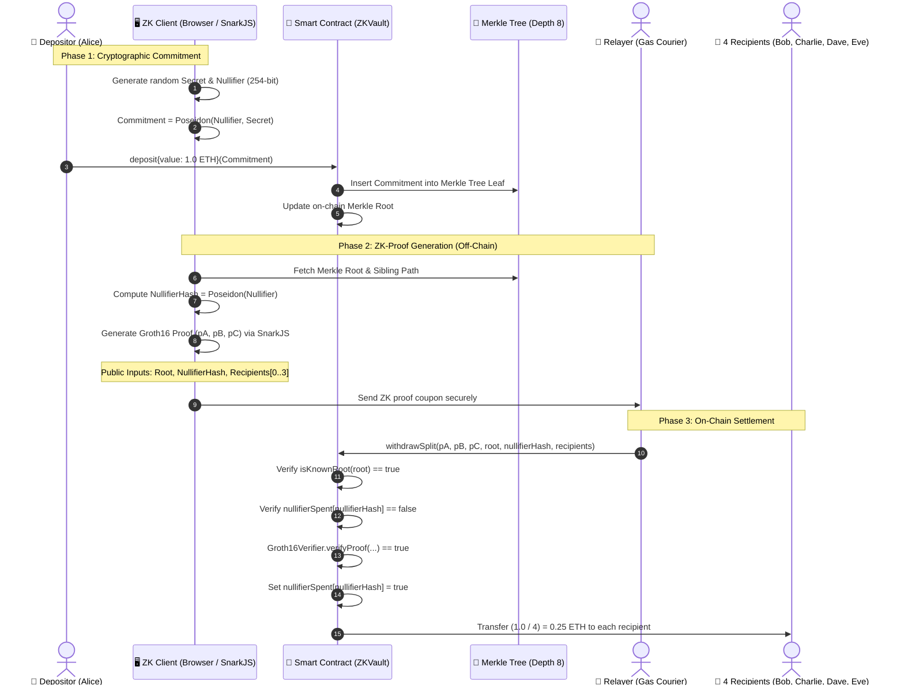

# 🛡️ ZK-Vault Splitter

> **1-to-4 Anonymous Privacy Pool & On-Chain Forensic Investigation Simulator**  
> An on-chain EVM privacy protocol powered by **Zero-Knowledge Proofs (ZK-SNARKs Groth16)**, featuring an interactive **Node-Graph Visualizer (Soft-Neobrutalism UI)** and a built-in **Blockchain De-anonymization & Forensic Audit Simulator**.

---

[ 🇺🇸 English ](./README_en.md) • [ 🇮🇩 Bahasa Indonesia ](./README.md) • [ 🇨🇳 简体中文 ](./README_zh.md)

---

[](https://soliditylang.org/)
[](https://docs.circom.io/)
[](https://github.com/iden3/snarkjs)
[](https://hardhat.org/)
[](https://www.typescriptlang.org/)
[](https://vitejs.dev/)
[](https://opensource.org/licenses/ISC)

---

## 📌 Table of Contents
1. [Executive Overview](#-executive-overview)
2. [Key Highlights](#-key-highlights)
3. [Architecture & Cryptographic Flow](#-architecture--cryptographic-flow)
4. [Repository Structure](#-repository-structure)
5. [Local Quickstart Guide](#-local-quickstart-guide)
6. [Automated Testing](#-automated-testing)
7. [Forensic Audit & De-anonymization Simulator](#-forensic-audit--de-anonymization-simulator)
8. [Deployment Parameters & Local Accounts](#-deployment-parameters--local-accounts)
9. [Security Disclaimer](#-security-disclaimer)

---

## 📖 Executive Overview

On public blockchains like Ethereum, the entire ledger is transparent. When **Alice** directly transfers funds to **Bob, Charlie, Dave, and Eve**, anyone can link their addresses through a standard block explorer.

**ZK-Vault Splitter** resolves this by cryptographically **unlinking the transaction graph**:
1. **Anonymous Deposit:** A depositor locks funds into the `ZKVault` smart contract along with a cryptographic commitment: `Commitment = Poseidon(nullifier, secret)`. The depositor's wallet address is **never recorded** on the Merkle leaf.
2. **ZK-SNARK Proof Coupon:** The depositor generates a mathematical proof without revealing their `secret`, `nullifier`, or wallet address. The 4 recipient addresses are locked as **public inputs** into the circuit, preventing third-party hijacking.
3. **Gasless Relaying:** An independent **Relayer** submits the `withdrawSplit` transaction on-chain on behalf of the recipients.
4. **On-Chain Equitable Payout:** The smart contract verifies the Groth16 proof on-chain, divides the vault deposit evenly into 4 equal shares, and transfers the funds directly to the 4 recipients.
5. **Outcome:** Zero on-chain link between the depositor's wallet and any of the four recipient wallets.

---

## ✨ Key Highlights

### 1. Zero-Knowledge Proofs (ZK-SNARKs Groth16)
- Circuit authored in **Circom 2.1** (`splitter.circom`) with **2,423 R1CS constraints**.
- Proves Merkle tree membership in zero-knowledge without revealing which leaf belongs to the withdrawer.

### 2. Poseidon Incremental Merkle Tree On-Chain
- Employs the SNARK-friendly arithmetic **Poseidon hash** for gas-optimized on-chain verification.
- Incremental Merkle Tree of depth 8 (supporting up to $2^8 = 256$ deposits per anonymity pool).

### 3. Comprehensive Attack Mitigation
- **Anti Double-Spending:** Tracks spent nullifiers on-chain (`nullifierSpent[nullifierHash] = true`). Any repeated withdrawal attempt reverts immediately.
- **Anti Front-Running / Hijacking:** Recipient addresses are bound to the proof's public inputs. If a malicious relayer attempts to substitute the recipient addresses with their own, the Groth16 verification fails mathematically (`revert: Invalid Zero-Knowledge proof`).
- **Anti Fake Deposit:** Withdrawals are only accepted against valid Merkle roots recorded by the vault contract (`isKnownRoot`).

### 4. Interactive Node-Graph Visualizer (Soft-Neobrutalism UI)
- Canvas-based node interface with interactive draggable Bezier cables (inspired by ComfyUI).
- **Cryptographic Wire Rule Detection:** Connecting cables to invalid ports triggers visual error shakes, red alert lines, and explanatory tooltips.
- **Dynamic Multi-Account & Denomination Control:** Switch between local accounts (*Alice, Bob, Charlie, Dave, Eve*) and adjust pool denominations on the fly (`0.4 ETH` to `10.0 ETH`).
- **Real-Time Hardhat Sync:** Live synchronization with the local EVM node showing balance mutations and contract states.

### 5. Blockchain Forensic Investigator Simulator
- Built-in audit suite evaluating privacy boundaries using a **5-Pillar De-anonymization Methodology**.
- **$k$-Anonymity Meter:** Automatically flags deterministic anonymity collapse when $k = 1$.
- **Temporal, Gas Funder, & Network Heuristics:** Calculates likelihood scores (0–100%) to rank candidate depositors and pinpoint the **Prime Suspect**.
- **Forensic Subpoena Evidence Export:** Export standardized investigation case files for CEX subpoena or security research simulations.

---

## ⚡ Architecture & Cryptographic Flow



---

## 📂 Repository Structure

```
blockchain/
├── dokumen/
│   ├── PROJECT_SUMMARY.md                  # Comprehensive technical architecture
│   └── PANDUAN_AUDIT_INVESTIGASI_FORENSIK.md # Forensic investigative SOP
├── walkthrough_result_zk_splitter.md       # Verification & test execution log
├── zk_splitter_plan.md                     # Initial implementation plan
└── zk-splitter-demo/
    ├── circuits/
    │   └── splitter.circom                 # Circom ZK-SNARK circuit
    ├── contracts/
    │   ├── ZKVault.sol                     # Primary vault smart contract
    │   ├── MerkleTreeWithHistory.sol       # Incremental Merkle tree logic
    │   ├── Groth16Verifier.sol             # SnarkJS autogenerated verifier
    │   └── IPoseidon.sol                   # Poseidon hash interface
    ├── build/
    │   ├── splitter.r1cs                   # Compiled R1CS constraint system
    │   ├── splitter_final.zkey             # Proving key
    │   ├── verification_key.json           # Verification key JSON
    │   └── splitter_js/                    # WASM witness generator
    ├── src/
    │   └── zk-utils.ts                     # Off-chain proof & Merkle utility library
    ├── test/
    │   └── zk-splitter.test.ts             # Hardhat automated unit test suite
    ├── scripts/
    │   ├── setup-circuits.ts               # Circuit compilation & trusted setup script
    │   └── deploy-and-simulate.ts          # On-chain deployment & simulation runner
    ├── api-bridge.ts                       # Express + SnarkJS + Ethers REST bridge
    ├── deployed-contracts.json             # Contract addresses & deployment cache
    ├── hardhat.config.ts                   # Hardhat EVM network configuration
    ├── package.json                        # Root dependencies
    └── frontend/
        ├── index.html                      # Node-graph dashboard HTML
        ├── src/
        │   ├── main.ts                     # Canvas logic, Bezier wires, & forensic modal
        │   └── style.css                   # Soft-Neobrutalism responsive design system
        ├── package.json                    # Frontend Vite dependencies
        └── vite.config.ts                  # Vite bundler configuration
```

---

## 🚀 Local Quickstart Guide

### Prerequisites
- **Node.js**: `v18.x` or `v20.x` (LTS recommended)
- **npm**: `v9.x` or later
- **Git**

---

### Step 1: Install Dependencies

```bash
# Navigate to the workspace
cd zk-splitter-demo

# Install backend & contract dependencies
npm install

# Install frontend dependencies
cd frontend
npm install
cd ..
```

---

### Step 2: Start Local Hardhat EVM Node (Terminal 1)

```bash
# Inside zk-splitter-demo/
npx hardhat node
```
*Spawns a local EVM network at `http://127.0.0.1:8545` with Chain ID `31337` and 20 pre-funded test accounts (10,000 ETH each).*

---

### Step 3: Deploy Smart Contracts & Simulate (Terminal 2)

```bash
# Inside zk-splitter-demo/
npx hardhat run scripts/deploy-and-simulate.ts --network localhost
```
*Deploys `Poseidon`, `Groth16Verifier`, and `ZKVault`, then populates `deployed-contracts.json` with fresh addresses.*

---

### Step 4: Launch API Bridge Server (Terminal 3)

```bash
# Inside zk-splitter-demo/
npx tsx api-bridge.ts
```
*Starts the Express server on port `3001` handling ZK witness generation, proof computation, and forensic investigation endpoints.*

---

### Step 5: Start Frontend Visualizer (Terminal 4)

```bash
# Inside zk-splitter-demo/frontend/
npm run dev
```
Open your browser and navigate to: **`http://localhost:5173/`**

---

## 🧪 Automated Testing

The repository includes a comprehensive unit test suite written with **Hardhat, Ethers.js, SnarkJS, and Chai**:

```bash
cd zk-splitter-demo
npx hardhat test
```

### Test Results:
```text
  ZK Private Vault & 1-to-4 Splitter
    ✔ Should deposit 1.0 ETH and update on-chain Merkle root correctly (146ms)
    ✔ Should successfully withdraw and split 1.0 ETH across 4 recipients via Relayer (482ms)
    ✔ Should prevent double-spending with the same ZK coupon / nullifier (354ms)
    ✔ Should prevent front-running: Relayer cannot substitute a recipient address (349ms)

  4 passing (2s)
```

---

## 🔬 Forensic Audit & De-anonymization Simulator

In addition to facilitating zero-knowledge privacy, this project incorporates an **On-Chain Forensic Investigation Suite** to educate researchers and developers on how real-world metadata leakages can erode cryptographic privacy.

### The 5-Pillar Investigative Methodology:
1. **Pillar 1: Merkle Tree Reconstruction ($k$-Anonymity):**
   - Traces the exact number of valid deposits ($k$) before a root was created.
   - **If $k = 1$:** Anonymity collapses deterministically (100% confidence).
2. **Pillar 2: Temporal & Denomination Correlation:**
   - Evaluates block proximity and matches the deposit denomination against the aggregate 4-way payout.
3. **Pillar 3: Chain Graph & Common Gas Funder Analysis:**
   - Detects whether the depositor ever funded the gas balances of the recipient wallets.
4. **Pillar 4: Network Metadata & Bridge Logs:**
   - Cross-references client IP addresses, user-agent signatures, and off-chain timestamps.
5. **Pillar 5: Forensic Likelihood Scoring:**
   - Calculates a normalized weighted confidence score (0–100%) and pinpoints the **Prime Suspect**.

---

## 📋 Deployment Parameters & Local Accounts

| Actor / Component | Address / Configuration | Description |
| :--- | :--- | :--- |
| **RPC Network** | `http://127.0.0.1:8545` | Hardhat Local EVM (Chain ID: `31337`) |
| **API Bridge** | `http://127.0.0.1:3001` | Express + SnarkJS Proof Generator |
| **Frontend Web** | `http://localhost:5173` | Vite + TypeScript Node-Graph Dashboard |
| **Poseidon Hasher** | `0xCf7Ed3AccA5a467e9e704C703E8D87F634fB0Fc9` | 2-Input Poseidon Hash Library |
| **Groth16Verifier** | `0xDc64a140Aa3E981100a9becA4E685f962f0cF6C9` | SnarkJS Groth16 Verifier Contract |
| **ZKVault** | `0x5FC8d32690cc91D4c39d9d3abcBD16989F875707` | Primary Privacy Pool Contract |
| **Alice (Account 1)** | `0x70997970C51812dc3A010C7d01b50e0d17dc79C8` | Default Depositor |
| **Bob (Account 2)** | `0x3C44CdDdB6a900fa2b585dd299e03d12FA4293BC` | Recipient #1 |
| **Charlie (Account 3)** | `0x90F79bf6EB2c4f870365E785982E1f101E93b906` | Recipient #2 |
| **Dave (Account 4)** | `0x15d34AAf54267DB7D7c367839AAf71A00a2C6A65` | Recipient #3 |
| **Eve (Account 5)** | `0x9965507D1a55bcC2695C58ba16FB37d819B0A4dc` | Recipient #4 |
| **Relayer** | `0x14dC79964da2C08b23698B3D3cc7Ca32193d9955` | Gasless Transaction Courier |

---

## ⚠️ Security Disclaimer

> This project is designed for **educational, visual demonstration, and research purposes**. The proving keys and circuits are configured for local experimentation. **Do not deploy these parameters directly to production mainnets without conducting a formal Multi-Party Computation (MPC) Trusted Setup ceremony and receiving independent third-party smart contract audits.**

---

## 📄 License

Distributed under the **ISC License**. Feel free to use, modify, and distribute for cryptographic research and blockchain education.
