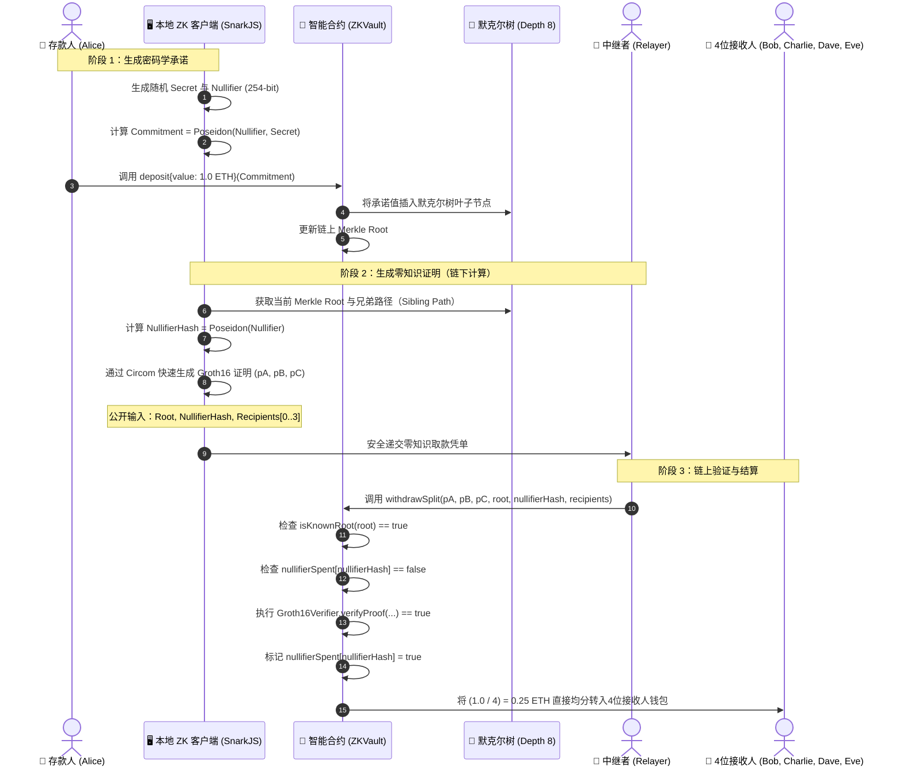

# 🛡️ ZK-Vault Splitter (零知识隐私拆分资金池)

> **1对4 零知识隐私资金池与链上数字取证调查模拟器**  
> 基于以太坊虚拟机（EVM）和**零知识证明（ZK-SNARKs Groth16）**的链上隐私协议。配备交互式 **Node-Graph 节点流可视化看板（Soft-Neobrutalism 风格）** 以及内置的**区块链反匿名取证审计模拟系统**。

---

[ 🇨🇳 简体中文 ](./README_zh.md) • [ 🇺🇸 English ](./README_en.md) • [ 🇮🇩 Bahasa Indonesia ](./README.md)

---

[](https://soliditylang.org/)
[](https://docs.circom.io/)
[](https://github.com/iden3/snarkjs)
[](https://hardhat.org/)
[](https://www.typescriptlang.org/)
[](https://vitejs.dev/)
[](https://opensource.org/licenses/ISC)

---

## 📌 目录
1. [项目概述](#-项目概述)
2. [核心功能特性](#-核心功能特性)
3. [密码学架构与零知识流程](#-密码学架构与零知识流程)
4. [项目目录结构](#-项目目录结构)
5. [本地快速上手指南](#-本地快速上手指南)
6. [自动化单元测试](#-自动化单元测试)
7. [链上取证调查与反匿名模拟器](#-链上取证调查与反匿名模拟器)
8. [部署参数与测试账户](#-部署参数与测试账户)
9. [安全免责声明](#-安全免责声明)

---

## 📖 项目概述

在以太坊等公开透明的区块链网络中，所有转账记录完全公开。如果 **Alice** 直接向 **Bob、Charlie、Dave 和 Eve** 转账，任何观察者都可以通过区块链浏览器轻而易举地追踪并串联起他们的交易图谱（Transaction Graph）。

**ZK-Vault Splitter** 通过纯数学密码学机制**切断交易图谱关联**：
1. **匿名存入（Deposit）：** 存款人将资金锁定至智能合约 `ZKVault`，并附带一个密码学承诺：`Commitment = Poseidon(nullifier, secret)`。存款人的钱包地址**绝不会被记录**在默克尔树叶子节点中。
2. **零知识凭证生成（ZK-SNARK Proof）：** 存款人在本地生成证明，无需泄露 `secret`（秘密随机数）、`nullifier`（废止凭证）或其钱包身份。4个接收者地址被锁定为该电路的**公开输入（Public Inputs）**，杜绝中途篡改。
3. **无 Gas 中继（Gasless Relaying）：** 独立的第三方中继者（Relayer）代表接收方发起 `withdrawSplit` 取款交易，接收方和存款人均无需暴露 Gas 资金流。
4. **链上均等拆分到账：** 智能合约在链上验证 Groth16 零知识证明，自动将资金等额划分为 4 份，直接分别转入 4 个接收者钱包。
5. **最终结果：** 区块链上完全不存在任何将存款人与这 4 个接收者关联的交易痕迹。

---

## ✨ 核心功能特性

### 1. 尖端零知识证明体系（ZK-SNARKs Groth16）
- 电路采用 **Circom 2.1** 编写（`splitter.circom`），包含 **2,423 个 R1CS 约束方程**。
- 在不暴露存款所在叶子索引的前提下，完美实现对默克尔树成员资格的零知识证明。

### 2. 链上 Poseidon 增量默克尔树
- 采用面向 SNARK 电路深度优化的 **Poseidon 算术哈希算法**，大幅节约链上验证 Gas 消耗。
- 树高设为 8（深度 8），每个隐私资金池支持多达 $2^8 = 256$ 笔独立存款。

### 3. 全方位密码学攻击防护
- **防止双花攻击（Anti Double-Spending）：** 链上实时记录 `nullifierSpent[nullifierHash] = true`，使用同一证明的二次取款将被合约直接拒绝。
- **防抢跑与恶意中继篡改（Anti Front-Running / Anti-Hijacking）：** 接收者地址被严格约束在电路公开输入中。若恶意 Relayer 试图替换接收地址，Groth16 链上数学校验将直接判定失败（`Invalid Zero-Knowledge proof`）。
- **杜绝虚假存款证明（Anti Fake Deposit）：** 取款仅接受由智能合约有效记录并公布的默克尔根（`isKnownRoot`）。

### 4. 交互式 Web3 节点图可视化面板（Soft-Neobrutalism UI）
- 借鉴专业图形软件（如 ComfyUI）的高性能 Canvas 节点界面，支持拖拽贝塞尔曲线电缆连接。
- **密码学连线规则检测：** 电缆误接将触发红色警报光效、节点震颤动效及悬浮逻辑错误提示。
- **动态多账户切换与面额自适应：** 任意在 5 个本地账户间切换存款人与接收人，支持 `0.4 ETH` 到 `10.0 ETH` 动态调节。
- **Hardhat 链上数据实时同步：** 本地 EVM 节点状态双向联动，合约余额变动实时反馈。

### 5. 链上取证调查与去匿名化模拟器（Forensic Investigator）
- 基于**五大取证支柱方法论**（5-Pillar Methodology），直观展示零知识隐私在现实世界的边界。
- **$k$-匿名集仪表盘（$k$-Anonymity Meter）：** 当 $k=1$ 时精准报警匿名集坍塌（100% 确定性去匿名）。
- **时间序列、Gas 资助人图谱与网络关联：** 综合计算可信度评分（0–100%），锁定首要嫌疑人（Prime Suspect）。
- **法证证据报告导出：** 一键生成标准化的证据档案，模拟司法或中心化交易所（CEX）传票调证。

---

## ⚡ 密码学架构与零知识流程



---

## 📂 项目目录结构

```
blockchain/
├── dokumen/
│   ├── PROJECT_SUMMARY.md                  # 架构与项目技术总结
│   └── PANDUAN_AUDIT_INVESTIGASI_FORENSIK.md # 链上数字取证标准作业程序（SOP）
├── walkthrough_result_zk_splitter.md       # 验证与测试运行记录
├── zk_splitter_plan.md                     # 开发实现计划书
└── zk-splitter-demo/
    ├── circuits/
    │   └── splitter.circom                 # Circom 零知识证明电路源码
    ├── contracts/
    │   ├── ZKVault.sol                     # 核心隐私资金池合约
    │   ├── MerkleTreeWithHistory.sol       # 链上增量默克尔树实现
    │   ├── Groth16Verifier.sol             # SnarkJS 自动生成的 Solidity 验证器
    │   └── IPoseidon.sol                   # Poseidon 算术哈希接口
    ├── build/
    │   ├── splitter.r1cs                   # 编译生成的 R1CS 约束文件
    │   ├── splitter_final.zkey             # ZK 证明密钥 (Proving Key)
    │   ├── verification_key.json           # 验证密钥 JSON
    │   └── splitter_js/                    # WASM 见证发生器
    ├── src/
    │   └── zk-utils.ts                     # 链下 Merkle 树生成与 Proof 构造库
    ├── test/
    │   └── zk-splitter.test.ts             # Hardhat 自动化单元测试套件
    ├── scripts/
    │   ├── setup-circuits.ts               # 电路编译与受信初始化脚本
    │   └── deploy-and-simulate.ts          # 合约部署与链上流程全景模拟
    ├── api-bridge.ts                       # 后端 REST 服务 (Express + SnarkJS)
    ├── deployed-contracts.json             # 部署合约地址及配置缓存
    ├── hardhat.config.ts                   # Hardhat 网络配置文件
    ├── package.json                        # 核心依赖清单
    └── frontend/
        ├── index.html                      # 节点图可视化前端入口
        ├── src/
        │   ├── main.ts                     # 画布渲染、连线交互与取证弹窗逻辑
        │   └── style.css                   # 柔和新粗野主义响应式样式表
        ├── package.json                    # 前端依赖
        └── vite.config.ts                  # Vite 打包配置
```

---

## 🚀 本地快速上手指南

### 环境要求
- **Node.js**: `v18.x` 或 `v20.x`（推荐 LTS 长期支持版）
- **npm**: `v9.x` 或更高版本
- **Git**

---

### 第一步：安装项目依赖

```bash
# 进入主目录
cd zk-splitter-demo

# 安装后端与合约相关依赖
npm install

# 安装前端依赖
cd frontend
npm install
cd ..
```

---

### 第二步：启动本地 Hardhat EVM 节点（终端 1）

```bash
# 在 zk-splitter-demo 目录下运行
npx hardhat node
```
*本地区块链节点将运行在 `http://127.0.0.1:8545`，Chain ID 为 `31337`，默认预置 20 个测试账户（各含 10,000 ETH）。*

---

### 第三步：部署合约并初始化模拟数据（终端 2）

```bash
# 在 zk-splitter-demo 目录下运行
npx hardhat run scripts/deploy-and-simulate.ts --network localhost
```
*自动完成 Poseidon、Groth16Verifier 和 ZKVault 部署，并将合约地址存入 `deployed-contracts.json`。*

---

### 第四步：启动 API 桥接服务（终端 3）

```bash
# 在 zk-splitter-demo 目录下运行
npx tsx api-bridge.ts
```
*后端 API 运行在 `http://127.0.0.1:3001`，负责处理链下 Witness 计算、ZK Proof 生成及反匿名调查取证接口。*

---

### 第五步：启动前端可视化面板（终端 4）

```bash
# 进入前端文件夹
cd frontend
npm run dev
```
打开浏览器访问：**`http://localhost:5173/`**

---

## 🧪 自动化单元测试

本项目包含使用 **Hardhat、Ethers.js、SnarkJS 和 Chai** 编写的高覆盖率自动化测试：

```bash
cd zk-splitter-demo
npx hardhat test
```

### 测试通过记录：
```text
  ZK Private Vault & 1-to-4 Splitter
    ✔ Should deposit 1.0 ETH and update on-chain Merkle root correctly (146ms)
    ✔ Should successfully withdraw and split 1.0 ETH across 4 recipients via Relayer (482ms)
    ✔ Should prevent double-spending with the same ZK coupon / nullifier (354ms)
    ✔ Should prevent front-running: Relayer cannot substitute a recipient address (349ms)

  4 passing (2s)
```

---

## 🔬 链上取证调查与反匿名模拟器

本项目特别内置了**反匿名调查取证工具箱**，用于帮助开发者直观理解真实世界中元数据泄漏对零知识隐私协议的冲击。

### 取证评估五大支柱：
1. **支柱 1：默克尔树回溯与 $k$-匿名集（$k$-Anonymity）：**
   - 追踪当前默克尔根生成前存在的所有有效存款记录。
   - **当 $k = 1$ 时：** 匿名集完全坍塌，100% 确定唯一嫌疑人。
2. **支柱 2：时间邻近性与面额关联（Temporal & Denomination）：**
   - 对比存款与取款发生的区块间隔，核验总金额与 4 份均等支出。
3. **支柱 3：链上交易图谱与共同 Gas 资助人（Common Gas Funder）：**
   - 探测存款人是否曾向 4 个接收钱包转账提供初始 Gas。
4. **支柱 4：网络层元数据与中继日志（Network & Bridge Logs）：**
   - 关联 API 请求的客户端 IP、User-Agent 签名及时间戳。
5. **支柱 5：似然度评分矩阵（Forensic Likelihood Scoring）：**
   - 输出加权综合可信度概率（0–100%），锁定首要嫌疑人（Prime Suspect）。

---

## 📋 部署参数与测试账户

| 角色 / 组件 | 地址 / 配置 | 说明 |
| :--- | :--- | :--- |
| **RPC 节点** | `http://127.0.0.1:8545` | Hardhat 本地 EVM (Chain ID: `31337`) |
| **API 桥接** | `http://127.0.0.1:3001` | Express + SnarkJS 证明生成后端 |
| **前端看板** | `http://localhost:5173` | Vite + TypeScript 可视化界面 |
| **Poseidon Hasher** | `0xCf7Ed3AccA5a467e9e704C703E8D87F634fB0Fc9` | 2-Input Poseidon 算术哈希库 |
| **Groth16Verifier** | `0xDc64a140Aa3E981100a9becA4E685f962f0cF6C9` | Groth16 链上验证器合约 |
| **ZKVault (资金池)**| `0x5FC8d32690cc91D4c39d9d3abcBD16989F875707` | 核心隐私拆分资金池合约 |
| **Alice (账户 1)** | `0x70997970C51812dc3A010C7d01b50e0d17dc79C8` | 默认存款人 |
| **Bob (账户 2)** | `0x3C44CdDdB6a900fa2b585dd299e03d12FA4293BC` | 接收人 #1 |
| **Charlie (账户 3)** | `0x90F79bf6EB2c4f870365E785982E1f101E93b906` | 接收人 #2 |
| **Dave (账户 4)** | `0x15d34AAf54267DB7D7c367839AAf71A00a2C6A65` | 接收人 #3 |
| **Eve (账户 5)** | `0x9965507D1a55bcC2695C58ba16FB37d819B0A4dc` | 接收人 #4 |
| **Relayer (中继者)**| `0x14dC79964da2C08b23698B3D3cc7Ca32193d9955` | 负责垫付链上 Gas 费用的中继节点 |

---

## ⚠️ 安全免责声明

> 本项目仅用于**学术研究、密码学教学演示及安全边界验证**。当前的证明密钥及初始化参数仅供本地模拟。**切勿直接将当前电路与参数部署至以太坊主网或任何生产环境。在进入生产环境前，必须经过严格的多方安全计算仪式（MPC Trusted Setup Ceremony）及专业独立安全审计机构的全面审计。**

---

## 📄 开源许可证

本项目基于 **ISC License** 开源。欢迎用于密码学学习、区块链安全研究及二次开发。
