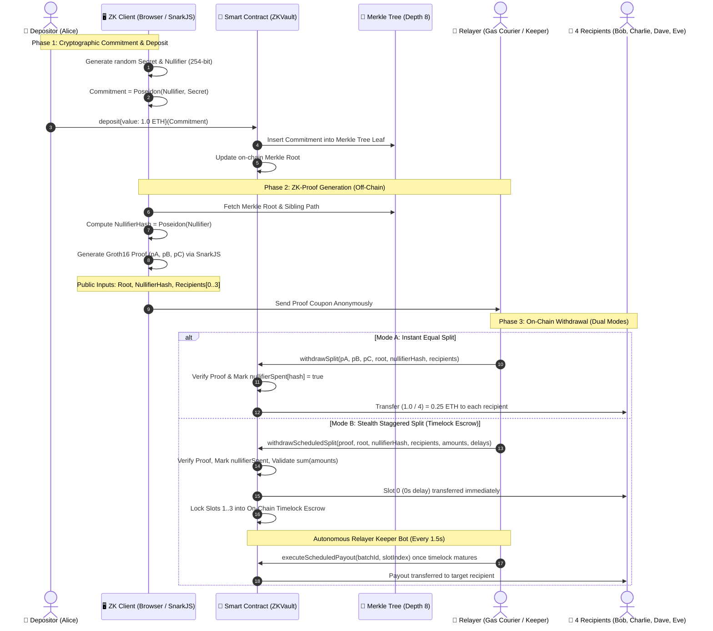

# 🛡️ ZK-Vault Splitter

> **1-to-4 Anonymous Privacy Pool & On-Chain Forensic Investigation Simulator**  
> An on-chain EVM privacy protocol powered by **Zero-Knowledge Proofs (ZK-SNARKs Groth16)**, featuring an interactive **Node-Graph Visualizer (Soft-Neobrutalism UI)**, autonomous **Relayer Keeper Bot**, interactive **Attack Immunity Simulator**, and a comprehensive **Blockchain De-anonymization & Forensic Audit Engine**.

---

[ 🇺🇸 English ](./README_en.md) • [ 🇮🇩 Bahasa Indonesia ](../README.md) • [ 🇨🇳 简体中文 ](./README_zh.md)

---

[](https://soliditylang.org/)
[](https://docs.circom.io/)
[](https://github.com/iden3/snarkjs)
[](https://hardhat.org/)
[](https://www.typescriptlang.org/)
[](https://vitejs.dev/)
[](https://opensource.org/licenses/ISC)

---

## 📌 Table of Contents
1. [Executive Overview](#-executive-overview)
2. [Key Highlights](#-key-highlights)
3. [Architecture & Cryptographic Flow](#-architecture--cryptographic-flow)
4. [Repository Structure](#-repository-structure)
5. [Local Quickstart Guide](#-local-quickstart-guide)
6. [Automated Testing](#-automated-testing)
7. [Forensic Audit & De-anonymization Simulator](#-forensic-audit--de-anonymization-simulator)
8. [Deployment Parameters & Local Accounts](#-deployment-parameters--local-accounts)
9. [Security Disclaimer](#-security-disclaimer)

---

## 📖 Executive Overview

On public blockchains like Ethereum, all transaction histories are recorded transparently (*public ledger*). When **Alice** directly transfers funds to **Bob, Charlie, Dave, and Eve**, anyone can trivially trace and connect their transaction graph using a standard block explorer.

**ZK-Vault Splitter** breaks this link through zero-knowledge privacy and cryptographic graph unlinking:
1. **Shielded Deposit:** A depositor locks funds into the `ZKVault` smart contract accompanied by a cryptographic commitment:  
   $$\text{Commitment} = \text{Poseidon}(\text{Nullifier}, \text{Secret})$$  
   The depositor's wallet address is **never recorded** in the Merkle leaf.
2. **ZK-SNARK Proof Generation:** The depositor generates a mathematical proof without revealing their `secret`, `nullifier`, or wallet address. The 4 recipient addresses are locked into the circuit's **public inputs**, preventing third-party theft or hijacking.
3. **Gasless Relaying:** An independent **Relayer** submits the withdrawal transaction to the smart contract on behalf of the recipients, paying the gas fee.
4. **Dual Split Modes:**
   - **Mode 1: Instant Equal Split (25% each):** The contract verifies the Groth16 proof, divides the vault denomination equally ($1/4$), and transfers the funds immediately in a single transaction (`withdrawSplit`).
   - **Mode 2: Stealth Staggered & Randomized Split:** The contract divides the funds into randomized amounts ($\sum \text{amounts} == \text{denomination}$) and distinct time-delay schedules (0–120 seconds) per recipient (`withdrawScheduledSplit`). Slot 0 (0s delay) is dispatched immediately, while slots 1–3 are placed in **On-Chain Timelock Escrow** and executed automatically by the **Relayer Keeper Bot** as their timelocks expire.
5. **Outcome:** Complete unlinking of the depositor's wallet from recipient wallets, nullifying amount clustering and temporal correlation heuristics.

---

## ✨ Key Highlights

### 1. Advanced Zero-Knowledge Proofs (ZK-SNARKs Groth16)
- Circuit authored in **Circom 2.1** (`splitter.circom`) compiling to **2,423 R1CS constraints**.
- Mathematically proves Merkle tree membership without disclosing the depositor's leaf index or identity.

### 2. On-Chain Incremental Poseidon Merkle Tree
- Employs the SNARK-friendly arithmetic **Poseidon hash** for gas-efficient on-chain verification.
- Depth 8 Merkle tree structure supporting up to 256 deposits per vault cycle.

### 3. Cryptographic Attack Immunity & Verification
- **Anti Double-Spending:** Tracks spent nullifiers on-chain (`nullifierSpent[nullifierHash] = true`). Any repeated attempt reverts instantly.
- **Anti Front-Running / Relayer Hijacking:** Recipient addresses are bound to the proof's public inputs. If a rogue relayer modifies any recipient address, Groth16 verification fails mathematically (`revert: Invalid Zero-Knowledge proof`).
- **Anti Fake Deposit:** Withdrawals are only valid against recognized on-chain roots (`isKnownRoot`).
- **Interactive In-UI Attack Simulator:** Dedicated buttons to test hijacking and double-spending attempts with real-time cryptographic revert feedback.

### 4. Dual Split Modes: Instant vs Stealth Staggered
- **Mode 1 (Instant 25% Split):** Divides denomination into equal 25% payouts instantly.
- **Mode 2 (Stealth Staggered Split):** Custom/randomized payouts with individual timelock delays (0–120s), defeating amount-matching heuristics and temporal clustering.

### 5. Autonomous Relayer Keeper Bot Daemon
- Background worker in `api-bridge.ts` continuously monitoring the blockchain every 1.5 seconds.
- Automatically invokes `executeScheduledPayout(batchId, slotIndex)` as each slot's timelock expires without requiring user intervention.

### 6. Pool Aging & Decoy Traffic Simulation ($k$-Anonymity Defense)
- **`🧪 Simulate Aging / Decoy Traffic`** button triggers automated background deposits.
- Expands the anonymity set ($k$-anonymity pool expansion), defeating $k=1$ de-anonymization heuristics and yielding **"DE-ANONYMIZATION FAILED (PRIVACY SAFE)"** forensic audit results.

### 7. Interactive Web3 Node-Graph Visualizer (Soft-Neobrutalism UI)
- Canvas-based node architecture with draggable Bezier cables (inspired by modern node editors like ComfyUI).
- **Cryptographic Wiring Validation:** Incompatible or illogical connections flash red, vibrate, and display tooltip warnings.
- **Multi-Account & Dynamic Denomination:** Seamlessly switch among local accounts (*Alice, Bob, Charlie, Dave, Eve*) and adjust pool denominations (`0.4 ETH` to `10.0 ETH`).
- **Live Countdown Pills & Progress Bars:** Real-time visual progress bars and second countdowns on recipient cards.
- **Audio Feedback (Web Audio API):** Synthesized micro-interaction audio feedback (plugging, clicks, success chimes, alerts).

### 8. Forensic Investigator Simulator (5-Pillar Methodology)
- Integrated on-chain inspection dashboard to evaluate privacy boundaries.
- **$k$-Anonymity Set Gauge:** Flags deterministic collapse when $k = 1$, and confirms anonymity safety when $k > 1$.
- **Temporal, Denomination & Gas Graph Analysis:** Evaluates funding patterns, gas providers, and candidate likelihood scores (0–100%).
- **Scheduled Transaction Traceability:** Resolves secondary keeper executions (`ScheduledPayoutDispatched`) back to original batch creations (`ScheduledSplitCreated`).
- **Dossier Export:** Formats and copies full case files for compliance and CEX subpoena simulation.

---

## ⚡ Architecture & Cryptographic Flow



---

## 📂 Repository Structure

```
blockchain/
├── README.md                               # Primary Repository Documentation (Bahasa Indonesia)
├── docs/
│   ├── PROJECT_SUMMARY.md                  # Comprehensive technical & architectural summary
│   ├── PANDUAN_AUDIT_INVESTIGASI_FORENSIK.md # 5-Pillar Forensic Audit Standard Operating Procedure
│   ├── README_en.md                        # English Documentation (This document)
│   ├── README_id.md                        # Bahasa Indonesia Documentation
│   ├── README_zh.md                        # 简体中文文档 (Simplified Chinese)
│   ├── walkthrough_result_zk_splitter.md   # Test execution & verification notes
│   └── zk_splitter_plan.md                 # Initial implementation plan archive
└── zk-splitter-demo/
    ├── circuits/
    │   └── splitter.circom                 # Circom ZK-SNARK Circuit (2,423 constraints)
    ├── contracts/
    │   ├── ZKVault.sol                     # Core Privacy Vault & Timelock Escrow Contract
    │   ├── MerkleTreeWithHistory.sol       # Incremental Poseidon Merkle Tree implementation
    │   ├── Groth16Verifier.sol             # SnarkJS-generated Groth16 Verifier
    │   └── IPoseidon.sol                   # Poseidon hash library interface
    ├── build/
    │   ├── splitter.r1cs                   # Compiled R1CS circuit constraints
    │   ├── splitter_final.zkey             # Proving key
    │   ├── verification_key.json           # Verification key
    │   └── splitter_js/                    # WASM witness generator
    ├── src/
    │   ├── zk-utils.ts                     # Proof generator & Poseidon Merkle tree utilities
    │   └── forensic-engine.ts              # 5-Pillar On-Chain Forensic Analysis Engine
    ├── test/
    │   ├── zk-splitter.test.ts             # Unit tests for equal split & security (4 tests)
    │   └── zk-scheduled-split.test.ts      # Unit tests for stealth timed split (3 tests)
    ├── scripts/
    │   ├── setup-circuits.ts               # Circuit compilation & Trusted Setup script
    │   ├── deploy-and-simulate.ts          # On-chain contract deployment & simulation
    │   ├── simulate-multitx.ts             # Multi-transaction deposit simulator
    │   └── test-k1.ts                      # De-anonymization testing script for k=1
    ├── api-bridge.ts                       # REST API Server (13 endpoints) + Relayer Keeper Daemon
    ├── deployed-contracts.json             # Local deployment address cache
    ├── hardhat.config.ts                   # Hardhat EVM configuration
    ├── package.json                        # Backend & smart contract dependencies
    └── frontend/
        ├── index.html                      # Interactive visualizer web app
        ├── src/
        │   ├── main.ts                     # Canvas logic, cabling, audio FX & audit modal
        │   └── style.css                   # Soft-Neobrutalism responsive design
        ├── package.json                    # Frontend Vite dependencies
        └── vite.config.ts                  # Vite bundler configuration
```

---

## 🚀 Local Quickstart Guide

### Prerequisites
- **Node.js**: version `v18.x`, `v20.x`, or `v22.x`.
- **npm**: version `9.x` or higher.
- **Git**

---

### Step 1: Clone Repository & Install Dependencies

```bash
cd zk-splitter-demo
npm install

cd frontend
npm install
cd ..
```

---

### Step 2: Start Local Hardhat EVM Node (Terminal 1)

```bash
cd zk-splitter-demo
npx hardhat node
```
*Runs at `http://127.0.0.1:8545` on Chain ID `31337` with 20 pre-funded test accounts (10,000 ETH each).*

---

### Step 3: Deploy Smart Contracts (Terminal 2)

```bash
cd zk-splitter-demo
npx hardhat run scripts/deploy-and-simulate.ts --network localhost
```

---

### Step 4: Launch API Bridge Server & Relayer Keeper (Terminal 3)

```bash
cd zk-splitter-demo
npx tsx api-bridge.ts
```
*Active on `http://127.0.0.1:3001` providing ZK proof generation, timelock escrow monitoring, decoy aging traffic, and forensic analysis endpoints.*

---

### Step 5: Start Frontend Visualizer (Terminal 4)

```bash
cd frontend
npm run dev
```
Open **`http://localhost:5173/`** in your browser.

---

## 🧪 Automated Testing

All cryptographic rules, smart contracts, and attack defense mechanisms are tested with Hardhat and Chai:

```bash
cd zk-splitter-demo
npx hardhat test
```

### Test Results (7 Passing Tests):
```text
  ZK Private Vault - Stealth Staggered & Randomized Split
    ✔ Should withdraw with randomized amounts and delayed timelock schedules (545ms)
    ✔ Should revert if randomized amounts do not sum up to denomination (361ms)
    ✔ Should prevent double-spending when using withdrawScheduledSplit (373ms)

  ZK Private Vault & 1-to-4 Splitter
    ✔ Should deposit 1.0 ETH and update on-chain Merkle root correctly (142ms)
    ✔ Should successfully withdraw and split 1.0 ETH across 4 recipients via Relayer (461ms)
    ✔ Should prevent double-spending with the same ZK coupon / nullifier (359ms)
    ✔ Should prevent front-running: Relayer cannot substitute a recipient address (360ms)


  7 passing (3s)
```

---

## 🔬 Forensic Audit & De-anonymization Simulator

In addition to enabling ZK privacy, this repository includes an on-chain **Forensic Investigator Dashboard** to examine how real-world metadata leakage can undermine cryptographic privacy.

### 5-Pillar Investigative Methodology:
1. **Pillar 1: Merkle Tree Reconstruction ($k$-Anonymity):**
   - Counts valid deposits prior to Merkle root publication.
   - **$k = 1$:** Deterministic anonymity collapse (100% certainty).
   - **$k > 1$ (Aged / Decoy Traffic):** De-anonymization fails; depositor is shielded within the crowd.
2. **Pillar 2: Temporal & Denomination Correlation:**
   - Compares deposit value with recipient outputs within proximate blocks. Stealth Mode substantially lowers this correlation.
3. **Pillar 3: Gas Funding & Peeling Chain Analysis:**
   - Detects whether the depositor funded the recipients' initial gas fees via cached multi-block scan.
4. **Pillar 4: Network Metadata & Bridge Telemetry:**
   - Cross-references client IP, user-agent, and timing from the API bridge.
5. **Pillar 5: Forensic Likelihood Scoring:**
   - Computes weighted likelihood scores (0–100%) to rank candidate depositors and identify the **Prime Suspect** or declare **Privacy Safe**.

---

## 📋 Deployment Parameters & Local Accounts

| Actor / Component | Address / Configuration | Description |
| :--- | :--- | :--- |
| **RPC Network** | `http://127.0.0.1:8545` | Hardhat Local EVM (Chain ID: `31337`) |
| **API Bridge** | `http://127.0.0.1:3001` | Express + SnarkJS + Relayer Keeper Daemon |
| **Frontend Web** | `http://localhost:5173` | Vite + TypeScript Node-Graph Dashboard |
| **Poseidon Hasher** | `0xCf7Ed3AccA5a467e9e704C703E8D87F634fB0Fc9` | 2-input Poseidon library |
| **Groth16Verifier** | `0xDc64a140Aa3E981100a9becA4E685f962f0cF6C9` | Groth16 Verifier Contract |
| **ZKVault (Vault)** | `0x5FC8d32690cc91D4c39d9d3abcBD16989F875707` | Primary Privacy Pool & Timelock Escrow |
| **Alice (Account 1)** | `0x70997970C51812dc3A010C7d01b50e0d17dc79C8` | Default Depositor |
| **Bob (Account 2)** | `0x3C44CdDdB6a900fa2b585dd299e03d12FA4293BC` | Recipient #1 |
| **Charlie (Account 3)** | `0x90F79bf6EB2c4f870365E785982E1f101E93b906` | Recipient #2 |
| **Dave (Account 4)** | `0x15d34AAf54267DB7D7c367839AAf71A00a2C6A65` | Recipient #3 |
| **Eve (Account 5)** | `0x9965507D1a55bcC2695C58ba16FB37d819B0A4dc` | Recipient #4 |
| **Relayer (Courier)** | `0x14dC79964da2C08b23698B3D3cc7Ca32193d9955` | On-Chain Gas Courier & Keeper Bot |

---

## ⚠️ Security Disclaimer

> This project is designed for **educational demonstration, privacy research, and cryptographic visualization**. Proving keys and circuit parameters were generated for local demonstration. **Do not deploy these parameters to production mainnets without a multi-party computation (MPC) ceremony and an independent formal security audit.**

---

## 📄 License

Distributed under the **ISC License**. Open for research, experimentation, and educational blockchain development.
