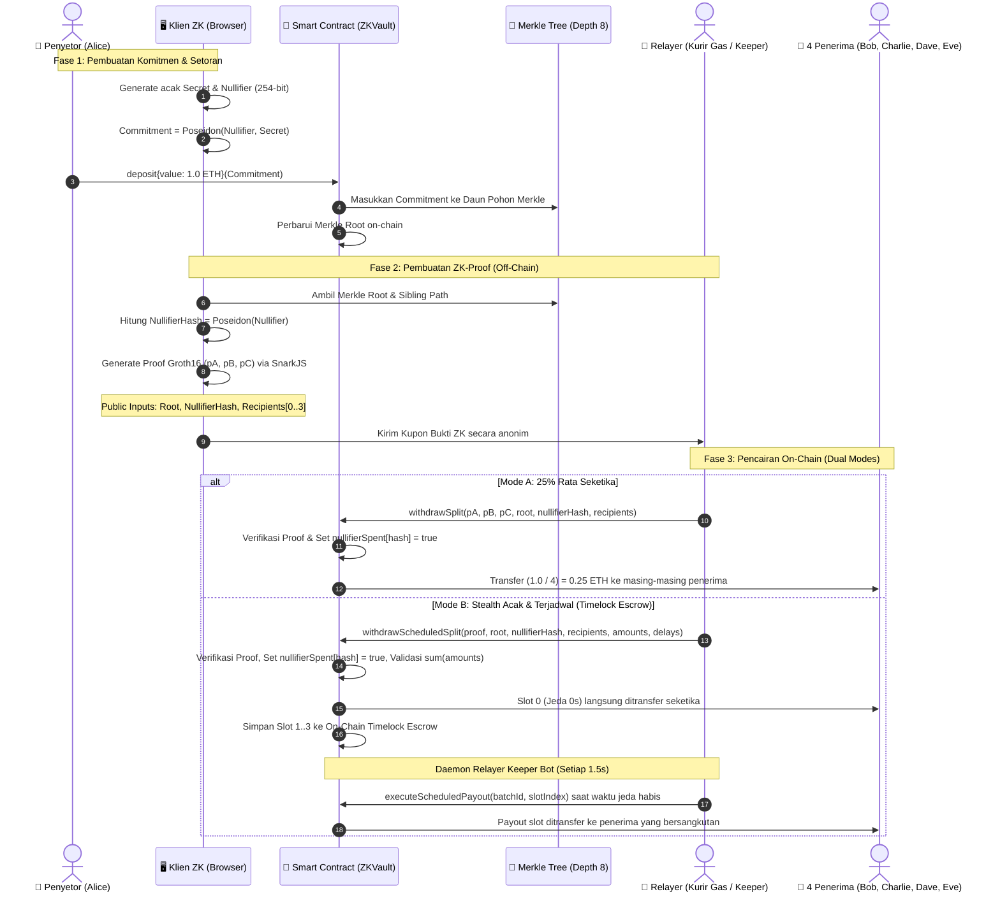

# 🛡️ ZK-Vault Splitter

> **1-to-4 Anonymous Privacy Pool & On-Chain Forensic Investigation Simulator**  
> Protokol privasi transaksi on-chain berbasis **Zero-Knowledge Proofs (ZK-SNARKs Groth16)** di atas Ethereum Virtual Machine (EVM), dilengkapi antarmuka interaktif **Node-Graph Visualizer (Soft-Neobrutalism UI)**, modul otomasi **Relayer Keeper Bot**, simulator **Uji Kekebalan Serangan**, serta modul **Audit Forensik De-anonimisasi Blockchain**.

---

[ 🇮🇩 Bahasa Indonesia ](../README.md) • [ 🇺🇸 English ](./README_en.md) • [ 🇨🇳 简体中文 ](./README_zh.md)

---

[](https://soliditylang.org/)
[](https://docs.circom.io/)
[](https://github.com/iden3/snarkjs)
[](https://hardhat.org/)
[](https://www.typescriptlang.org/)
[](https://vitejs.dev/)
[](https://opensource.org/licenses/ISC)

---

## 📌 Daftar Isi
1. [Ringkasan Proyek](#-ringkasan-proyek)
2. [Fitur Unggulan](#-fitur-unggulan)
3. [Arsitektur & Alur Kriptografi ZK](#-arsitektur--alur-kriptografi-zk)
4. [Struktur Repositori](#-struktur-repositori)
5. [Panduan Menjalankan Proyek Secara Lokal](#-panduan-menjalankan-proyek-secara-lokal)
6. [Pengujian Otomatis (Unit Testing)](#-pengujian-otomatis-unit-testing)
7. [Simulator Audit Forensik & De-anonimisasi](#-simulator-audit-forensik--de-anonimisasi)
8. [Parameter Deployment & Akun Simulasi](#-parameter-deployment--akun-simulasi)
9. [Disclaimer Keamanan](#-disclaimer-keamanan)

---

## 📖 Ringkasan Proyek

Pada blockchain publik seperti Ethereum, seluruh riwayat transaksi dapat dilacak secara transparan (*public ledger*). Jika **Alice** mengirim dana secara langsung ke **Bob, Charlie, Dave, dan Eve**, siapa pun dapat menghubungkan graf transaksi tersebut melalui block explorer.

**ZK-Vault Splitter** memecahkan masalah ini dengan memutus tautan graf transaksi (*unlinking transaction graph*):
1. **Setoran Anonim (*Deposit*):** Penyetor mendepositkan dana ke dalam smart contract `ZKVault` disertai nilai komitmen kriptografi `Commitment = Poseidon(nullifier, secret)`. Alamat dompet penyetor **tidak dicatat** pada daun pohon privasi.
2. **Kupon Pembuktian (*ZK-SNARK Proof*):** Penyetor membuat bukti matematika tanpa mengungkap `secret`, `nullifier`, maupun alamat aslinya. Alamat 4 dompet penerima dikunci ke dalam *public inputs* sirkuit ZK agar bukti tidak dapat dibajak.
3. **Pencairan Tanpa Gas (*Gasless Relaying*):** Kurir independen (*Relayer*) mengirimkan transaksi pencairan ke smart contract atas nama penerima.
4. **Pilihan 2 Metode Pencairan (Dual Split Modes):**
   - **Mode 1: 25% Rata Seketika (*Instant Equal Split*):** Kontrak memverifikasi bukti Groth16, membagi dana rata ($1/4$), dan mengirimkannya seketika dalam 1 blok transaksi (`withdrawSplit`).
   - **Mode 2: Stealth Acak & Terjadwal (*Stealth Staggered & Randomized Split*):** Kontrak membagi dana dengan nominal acak ($\sum \text{amounts} == \text{denomination}$) dan jadwal jeda waktu (0–120 detik) per dompet penerima (`withdrawScheduledSplit`). Slot pertama dikirim instan, sedangkan slot sisanya disimpan dalam **On-Chain Timelock Escrow** dan dieksekusi otomatis oleh **Relayer Keeper Bot** saat waktu jeda jatuh tempo.
5. **Hasil Akhir:** Tidak ada jejak transaksi on-chain yang menghubungkan dompet penyetor dengan dompet para penerima, serta memecah korelasi klaster nominal dan waktu transfer.

---

## ✨ Fitur Unggulan

### 1. Kriptografi Zero-Knowledge Mutakhir (ZK-SNARKs Groth16)
- Sirkuit ZK ditulis menggunakan bahasa **Circom 2.1** (`splitter.circom`) dengan **2.423 constraints R1CS**.
- Menjamin pembuktian keanggotaan Merkle Tree secara *zero-knowledge* tanpa membocorkan indeks daun setoran.

### 2. Pohon Merkle Inkremental Poseidon On-Chain
- Menggunakan fungsi hash aritmatika **Poseidon** yang sangat hemat gas pada verifikasi ZK.
- Pohon Merkle berkedalaman 8 (*depth 8*) dengan kapasitas 256 daun setoran per brankas privasi.

### 3. Perlindungan & Uji Kekebalan Serangan Kriptografi
- **Anti Double-Spending:** Setiap penarikan memvalidasi `nullifierSpent[nullifierHash] == false` dan langsung menandainya `true` di storage kontrak.
- **Anti Front-Running / Hijacking:** 4 alamat penerima terikat permanen pada *public inputs* sirkuit. Jika Relayer nakal mencoba mengganti alamat penerima, verifikasi Groth16 otomatis gagal (`Invalid Zero-Knowledge proof`).
- **Anti Fake Deposit:** Penarikan hanya dapat dilakukan terhadap `root` pohon Merkle yang sah dan pernah diterbitkan oleh smart contract (`isKnownRoot`).
- **Panel Uji Serangan Interaktif:** Tombol langsung di antarmuka untuk menguji eksploitasi pembajakan kurir dan pengeluaran ganda dengan pembuktian revert seketika.

### 4. Dual Split Modes: Instant Equal Split & Stealth Staggered Split
- **Mode 1: 25% Rata Seketika (*Instant Equal Split*):** Membagi rata denominasi menjadi $1/4$ langsung ke 4 penerima dalam 1 transaksi penarikan.
- **Mode 2: Stealth Acak & Terjadwal (*Stealth Staggered & Randomized Split*):** Mengacak nominal transfer ($\sum \text{amounts} == \text{denomination}$) dan menjadwalkan jeda waktu transfer (0–120 detik) per dompet penerima. Slot pertama dikirim instan, sedangkan slot sisanya disimpan dalam **On-Chain Timelock Escrow** dan dieksekusi otomatis oleh **Relayer Keeper Bot** begitu waktu jeda tercapai. Ini memutus korelasi nominal kembar (*amount clustering*) dan stempel waktu blok (*temporal correlation*).

### 5. Daemon Relayer Keeper Bot Otonom
- Layanan latar belakang otonom pada API Bridge yang memindai blockchain setiap 1.5 detik.
- Mengirimkan transaksi eksekusi `executeScheduledPayout(batchId, slotIndex)` secara otomatis saat waktu jeda jatuh tempo tanpa membutuhkan intervensi manual dari pengguna.

### 6. Simulasi Penuaan Pool & Setoran Umpan (*Deposit Aging & Decoy Traffic*)
- Tombol **`🧪 Simulasi Aging / Decoy Traffic`** memungkinkan pengguna menyuntikkan setoran umpan acak ke dalam brankas.
- Memperbesar ukuran himpunan anonimitas ($k$-anonymity pool expansion) guna menangkal analisis forensik skenario $k=1$, menghasilkan status **"DE-ANONIMISASI GAGAL (PRIVASI AMAN)"**.

### 7. Antarmuka Interaktif Web3 Node-Graph (Soft-Neobrutalism UI)
- Visualisasi berbasis kanvas dengan sistem kabel kurva Bezier interaktif (mirip ComfyUI).
- **Deteksi Kesalahan Logika Kriptografi:** Jika kabel dicolokkan ke port yang salah, kabel otomatis menyala merah, node bergetar, dan muncul peringatan interaktif.
- **Dukungan Multi-Akun & Denominasi Dinamis:** Bebas memilih penyetor dan nominal setoran (0.4 ETH s.d. 10.0 ETH).
- **Stealth Configuration Drawer & Sliders:** Pengaturan slider jeda detik interaktif, input nominal dinamis, generator acak, dan tombol preset demo cepat.
- **Lencana Countdown Live & Progress Bar:** Animasi pengisian waktu jeda on-chain secara real-time pada setiap kartu penerima.
- **Sinkronisasi Saldo Real-Time:** Saldo brankas dan saldo penerima terhubung langsung ke node blockchain Hardhat EVM lokal.
- **Pelacak Riwayat Pencairan:** Menampilkan riwayat batch transaksi pencairan dan status slot secara live.
- **Mikro-Interaksi Audio:** Umpan balik suara interaktif menggunakan Web Audio API.

### 8. Simulator Audit Forensik & Investigasi On-Chain (Forensic Investigator)
- Antarmuka inspeksi terpadu untuk menganalisis batas privasi ZK menggunakan **Metodologi Investigasi 5 Pilar**.
- **Meteran $k$-Anonymity Set:** Mendeteksi keruntuhan privasi secara deterministik jika $k=1$, serta status aman jika $k > 1$.
- **Korelasi Temporal, Graf Gas, & Log Off-Chain:** Menghitung skor keyakinan (*Likelihood Score*) untuk mengidentifikasi tersangka penyetor asli.
- **Dukungan Transaksi Terjadwal:** Menautkan transaksi eksekusi sekunder (`ScheduledPayoutDispatched`) kembali ke transaksi induk penciptaan batch (`ScheduledSplitCreated`).
- **Ekspor Dokumen Forensik:** Salin berkas bukti terstruktur untuk simulasi laporan regulasi / *CEX Subpoena*.

---

## ⚡ Arsitektur & Alur Kriptografi ZK



---

## 📂 Struktur Repositori

```
blockchain/
├── README.md                               # Dokumentasi Utama Repositori (Bahasa Indonesia)
├── docs/
│   ├── PROJECT_SUMMARY.md                  # Dokumentasi arsitektur teknis lengkap & up-to-date
│   ├── PANDUAN_AUDIT_INVESTIGASI_FORENSIK.md # Panduan standar operasional forensik 5-pilar
│   ├── README_en.md                        # English documentation
│   ├── README_id.md                        # Dokumentasi Versi Bahasa Indonesia
│   ├── README_zh.md                        # 简体中文文档 (Simplified Chinese)
│   ├── walkthrough_result_zk_splitter.md   # Catatan hasil verifikasi & pengujian
│   └── zk_splitter_plan.md                 # Dokumen perencanaan awal
└── zk-splitter-demo/
    ├── circuits/
    │   └── splitter.circom                 # Sirkuit ZK-SNARK Circom (2.423 constraints)
    ├── contracts/
    │   ├── ZKVault.sol                     # Smart contract brankas utama & timelock escrow
    │   ├── MerkleTreeWithHistory.sol       # Implementasi pohon Merkle inkremental
    │   ├── Groth16Verifier.sol             # Kontrak verifier ZK hasil compile snarkjs
    │   └── IPoseidon.sol                   # Interface perpustakaan hash Poseidon
    ├── build/
    │   ├── splitter.r1cs                   # Kompilasi R1CS sirkuit
    │   ├── splitter_final.zkey             # Proving key ZK
    │   ├── verification_key.json           # Verification key JSON
    │   └── splitter_js/                    # Witness generator WASM
    ├── src/
    │   ├── zk-utils.ts                     # Utility generator proof & Merkle tree
    │   └── forensic-engine.ts              # Mesin Analisis Forensik 5-Pilar On-Chain
    ├── test/
    │   ├── zk-splitter.test.ts             # Pengujian unit otomatis alur equal split (4 tests)
    │   └── zk-scheduled-split.test.ts      # Pengujian unit otomatis stealth timed split (3 tests)
    ├── scripts/
    │   ├── setup-circuits.ts               # Skrip kompilasi Circom & Trusted Setup
    │   ├── deploy-and-simulate.ts          # Skrip deploy & simulasi on-chain
    │   ├── simulate-multitx.ts             # Skrip injeksi setoran multi-transaksi
    │   └── test-k1.ts                      # Skrip uji de-anonimisasi skenario k=1
    ├── api-bridge.ts                       # REST API Server (13 endpoints) + Relayer Keeper Daemon
    ├── deployed-contracts.json             # Cache alamat kontrak lokal
    ├── hardhat.config.ts                   # Konfigurasi Hardhat EVM
    ├── package.json                        # Dependensi backend & smart contract
    └── frontend/
        ├── index.html                      # Halaman visualizer node-graph
        ├── src/
        │   ├── main.ts                     # Logika kanvas, interaksi kabel, audio FX, & modal audit
        │   └── style.css                   # Desain Soft-Neobrutalism responsif
        ├── package.json                    # Dependensi frontend Vite
        └── vite.config.ts                  # Konfigurasi bundler Vite
```

---

## 🚀 Panduan Menjalankan Proyek Secara Lokal

### Prasyarat Sistem
- **Node.js**: versi `v18.x`, `v20.x`, atau `v22.x`.
- **npm**: versi `9.x` atau lebih baru.
- **Git**

---

### Langkah 1: Clone Repositori & Install Dependensi

```bash
# Masuk ke direktori proyek
cd zk-splitter-demo

# Install dependensi backend & smart contract
npm install

# Install dependensi frontend
cd frontend
npm install
cd ..
```

---

### Langkah 2: Jalankan Node Hardhat EVM Lokal (Terminal 1)

```bash
# Di direktori zk-splitter-demo
npx hardhat node
```
*Node akan berjalan di `http://127.0.0.1:8545` dengan Chain ID `31337` dan 20 akun lokal yang memiliki saldo bawaan 10.000 ETH.*

---

### Langkah 3: Deploy Smart Contracts & Inisialisasi State (Terminal 2)

```bash
# Di direktori zk-splitter-demo
npx hardhat run scripts/deploy-and-simulate.ts --network localhost
```
*Skrip ini akan mengompilasi kontrak, melakukan deployment library Poseidon, Groth16Verifier, dan ZKVault, lalu menyimpan alamat kontrak ke `deployed-contracts.json`.*

---

### Langkah 4: Jalankan API Bridge Server & Relayer Keeper (Terminal 3)

```bash
# Di direktori zk-splitter-demo
npx tsx api-bridge.ts
```
*API Bridge aktif di `http://127.0.0.1:3001` untuk melayani pembuatan ZK-proof, estimasi gas, antrean timelock escrow, simulasi penuaan pool, dan endpoint investigasi forensik.*

---

### Langkah 5: Jalankan Frontend Web Visualizer (Terminal 4)

```bash
# Masuk ke folder frontend
cd frontend
npm run dev
```
Buka browser pada: **`http://localhost:5173/`**

---

## 🧪 Pengujian Otomatis (Unit Testing)

Repositori ini dilengkapi rangkaian pengujian unit otomatis komprehensif menggunakan **Hardhat, Ethers.js, SnarkJS, dan Chai**:

```bash
cd zk-splitter-demo
npx hardhat test
```

### Hasil Pengujian (7 Passing Tests):
```text
  ZK Private Vault - Stealth Staggered & Randomized Split
    ✔ Should withdraw with randomized amounts and delayed timelock schedules (545ms)
    ✔ Should revert if randomized amounts do not sum up to denomination (361ms)
    ✔ Should prevent double-spending when using withdrawScheduledSplit (373ms)

  ZK Private Vault & 1-to-4 Splitter
    ✔ Should deposit 1.0 ETH and update on-chain Merkle root correctly (142ms)
    ✔ Should successfully withdraw and split 1.0 ETH across 4 recipients via Relayer (461ms)
    ✔ Should prevent double-spending with the same ZK coupon / nullifier (359ms)
    ✔ Should prevent front-running: Relayer cannot substitute a recipient address (360ms)


  7 passing (3s)
```

---

## 🔬 Simulator Audit Forensik & De-anonimisasi

Selain memfasilitasi privasi ZK, proyek ini menyediakan antarmuka **Investigasi Forensik On-Chain** untuk mempelajari bagaimana privasi ZK dapat runtuh di dunia nyata akibat kebocoran metadata perilaku.

### Metodologi 5 Pilar Evaluasi Forensik:
1. **Pilar 1: Rekonstruksi Pohon Merkle ($k$-Anonymity):**
   - Menghitung jumlah setoran valid sebelum Merkle Root diterbitkan.
   - **Jika $k = 1$:** Anonimitas runtuh 100% (*Deterministic De-anonymization*).
   - **Jika $k > 1$ (Aged / Decoy Traffic):** De-anonimisasi gagal, status privasi aman di dalam kerumunan penyetor.
2. **Pilar 2: Korelasi Temporal & Denominasi:**
   - Mencocokkan nilai setoran brankas dengan total dana yang diterima 4 penerima pada selang waktu blok yang berdekatan. Mode Stealth secara drastis menurunkan skor korelasi ini.
3. **Pilar 3: Analisis Graf Rantai & Sumber Gas (*Common Gas Funder*):**
   - Mendeteksi apakah penyetor pernah mendanai saldo ETH awal dari salah satu dompet penerima menggunakan penelusuran histori blok dengan caching berkinerja tinggi.
4. **Pilar 4: Metadata Jaringan & Log Bridge:**
   - Menganalisis korelasi IP klien, *user-agent*, dan stempel waktu off-chain pada API Bridge.
5. **Pilar 5: Matriks Pembobotan Keyakinan (*Forensic Likelihood Scoring*):**
   - Menghitung skor akumulasi (0–100%) dan menetapkan profil **Tersangka Utama (*Prime Suspect*)** atau **Privasi Aman**.

---

## 📋 Parameter Deployment & Akun Simulasi

| Komponen / Aktor | Alamat / Konfigurasi | Deskripsi |
| :--- | :--- | :--- |
| **RPC Network** | `http://127.0.0.1:8545` | Hardhat Local EVM (Chain ID: `31337`) |
| **API Bridge** | `http://127.0.0.1:3001` | Express + SnarkJS + Relayer Keeper Daemon |
| **Frontend Web** | `http://localhost:5173` | Vite + TypeScript Node-Graph Dashboard |
| **Poseidon Hasher** | `0xCf7Ed3AccA5a467e9e704C703E8D87F634fB0Fc9` | Library Poseidon 2-input |
| **Groth16Verifier** | `0xDc64a140Aa3E981100a9becA4E685f962f0cF6C9` | Kontrak Verifier ZK Groth16 |
| **ZKVault (Brankas)**| `0x5FC8d32690cc91D4c39d9d3abcBD16989F875707` | Kontrak Utama Privacy Pool & Timelock Escrow |
| **Alice (Akun 1)** | `0x70997970C51812dc3A010C7d01b50e0d17dc79C8` | Akun Penyetor Default |
| **Bob (Akun 2)** | `0x3C44CdDdB6a900fa2b585dd299e03d12FA4293BC` | Penerima #1 |
| **Charlie (Akun 3)** | `0x90F79bf6EB2c4f870365E785982E1f101E93b906` | Penerima #2 |
| **Dave (Akun 4)** | `0x15d34AAf54267DB7D7c367839AAf71A00a2C6A65` | Penerima #3 |
| **Eve (Akun 5)** | `0x9965507D1a55bcC2695C58ba16FB37d819B0A4dc` | Penerima #4 |
| **Relayer (Kurir)** | `0x14dC79964da2C08b23698B3D3cc7Ca32193d9955` | Kurir Pembayar Gas On-Chain & Keeper Bot |

---

## ⚠️ Disclaimer Keamanan

> Proyek ini dirancang sebagai **media edukasi, visualisasi penelitian, dan simulasi keamanan privasi kriptografi ZK**. Kunci pembuktian (*proving key / trusted setup*) dibuat untuk keperluan demonstrasi lokal. **Jangan gunakan parameter atau kunci sirkuit ini langsung pada jaringan produksi (Ethereum Mainnet) tanpa melalui fase *Multi-Party Computation (MPC) Trusted Setup Ceremony* dan audit keamanan formal oleh pihak ketiga independen.**

---

## 📄 Lisensi

Didistribusikan di bawah lisensi **ISC License**. Bebas dikembangkan dan dimodifikasi untuk tujuan penelitian dan pembelajaran kriptografi blockchain.
