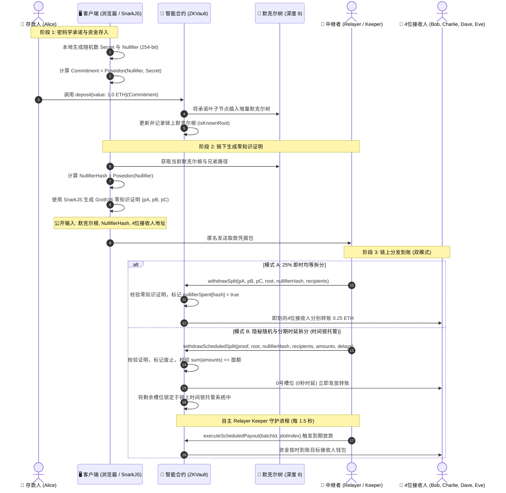

# 🛡️ ZK-Vault Splitter (零知识隐私拆分资金池)

> **1对4 零知识隐私资金池与链上数字取证调查模拟器**  
> 基于以太坊虚拟机（EVM）和**零知识证明（ZK-SNARKs Groth16）**的链上隐私协议。配备交互式 **Node-Graph 节点流可视化看板（Soft-Neobrutalism 风格）**、自主 **Relayer Keeper 守护进程**、**密码学攻击免疫模拟器** 以及内置的**区块链反匿名数字取证审计系统**。

---

[ 🇨🇳 简体中文 ](./README_zh.md) • [ 🇺🇸 English ](./README_en.md) • [ 🇮🇩 Bahasa Indonesia ](../README.md)

---

[](https://soliditylang.org/)
[](https://docs.circom.io/)
[](https://github.com/iden3/snarkjs)
[](https://hardhat.org/)
[](https://www.typescriptlang.org/)
[](https://vitejs.dev/)
[](https://opensource.org/licenses/ISC)

---

## 📌 目录
1. [项目概述](#-项目概述)
2. [核心功能特性](#-核心功能特性)
3. [密码学架构与零知识流程](#-密码学架构与零知识流程)
4. [项目目录结构](#-项目目录结构)
5. [本地快速上手指南](#-本地快速上手指南)
6. [自动化单元测试](#-自动化单元测试)
7. [链上取证调查与反匿名模拟器](#-链上取证调查与反匿名模拟器)
8. [部署参数与测试账户](#-部署参数与测试账户)
9. [安全免责声明](#-安全免责声明)

---

## 📖 项目概述

在以太坊等公开透明的区块链网络中，所有转账记录完全公开。如果 **Alice** 直接向 **Bob、Charlie、Dave 和 Eve** 转账，任何观察者都可以通过区块链浏览器轻而易举地追踪并串联起他们的交易图谱（Transaction Graph）。

**ZK-Vault Splitter** 通过纯数学密码学机制**切断交易图谱关联**：
1. **隐匿存款（Shielded Deposit）：** 存款人将资金锁定至智能合约 `ZKVault`，并附带密码学承诺：  
   $$\text{Commitment} = \text{Poseidon}(\text{Nullifier}, \text{Secret})$$  
   存款人的钱包地址**绝不会被记录**在默克尔树叶子节点中。
2. **零知识凭证生成（ZK-SNARK Proof）：** 存款人在本地生成证明，无需泄露 `secret`（秘密随机数）、`nullifier`（废止凭证）或其真实身份。4个接收者地址被严格锁定为电路的**公开输入（Public Inputs）**，杜绝中途篡改。
3. **无 Gas 中继（Gasless Relaying）：** 独立的第三方中继者（Relayer）代表接收方发起取款交易，接收方和存款人均无需暴露 Gas 关联。
4. **双重拆分取款模式（Dual Split Modes）：**
   - **模式 1: 25% 即时均等拆分（Instant Equal Split）：** 智能合约验证 Groth16 零知识证明，自动将资金划分为 4 份均等份额（$1/4$），在单笔交易中即时分发完毕（`withdrawSplit`）。
   - **模式 2: 隐秘随机与分期时延拆分（Stealth Staggered & Randomized Split）：** 合约按随机金额（$\sum \text{amounts} == \text{denomination}$）和独立时延调度（0–120秒）进行分发（`withdrawScheduledSplit`）。第0号槽位（0秒时延）即时发放，剩余槽位进入**链上时间锁托管系统（Timelock Escrow）**，由 **Relayer Keeper Bot** 自动在到期区块执行放款。
5. **最终结果：** 彻底切断存款人与接收者之间的链上交易图谱，瓦解金额聚类分析（Amount Clustering）与时间关联分析（Temporal Correlation）。

---

## ✨ 核心功能特性

### 1. 尖端零知识证明体系（ZK-SNARKs Groth16）
- 电路采用 **Circom 2.1** 编写（`splitter.circom`），包含 **2,423 个 R1CS 约束方程**。
- 在不暴露存款所在叶子索引的前提下，完美实现对默克尔树成员资格的零知识证明。

### 2. 链上 Poseidon 增量默克尔树
- 采用面向 SNARK 电路深度优化的 **Poseidon 算术哈希算法**，大幅节约链上验证 Gas 消耗。
- 树高设为 8（深度 8），每个隐私资金池支持多达 $2^8 = 256$ 笔独立存款。

### 3. 全方位密码学攻击防护与验证
- **防止双花攻击（Anti Double-Spending）：** 链上实时记录 `nullifierSpent[nullifierHash] = true`，使用同一证明的二次取款将被合约直接拒绝。
- **防抢跑与恶意中继篡改（Anti Front-Running / Anti-Hijacking）：** 接收者地址被严格约束在电路公开输入中。若恶意 Relayer 试图替换接收地址，Groth16 链上数学校验将直接判定失败（`revert: Invalid Zero-Knowledge proof`）。
- **防伪造存款（Anti Fake Deposit）：** 仅接受合约历史记录中的合法默克尔根（`isKnownRoot`）。
- **交互式攻击测试面板：** 前端内置一键测试中继劫持与双花攻击按钮，即时展示底层数学校验拦截与回滚详情。

### 4. 双重拆分模式：即时均等 vs 隐秘分期随机
- **模式 1: 25% 即时均等拆分：** 单笔交易内迅速分发 25% 均等份额。
- **模式 2: 隐秘随机延时拆分：** 自定义/随机化各接收人金额并设置时间锁延迟（0–120s），打破链上时间与金额聚类规律。

### 5. 自主 Relayer Keeper 守护进程
- 后台驻留于 `api-bridge.ts`，每 1.5 秒自动轮询区块链状态。
- 当时间锁到期（`block.timestamp >= releaseTime`）时，自动触发 `executeScheduledPayout(batchId, slotIndex)` 放款，无需用户干预。

### 6. 资金池陈化与诱饵流量模拟（$k$-匿名集防御）
- 提供 **`🧪 模拟陈化 / 诱饵流量`** 按钮，自动向资金池批量注入伪装存款。
- 扩大匿名集容量（$k$-anonymity pool expansion），击碎 $k=1$ 时的单点取证破译，使取证分析返回 **"反匿名失败（隐私安全）"**。

### 7. 交互式 Web3 节点图流界面（Soft-Neobrutalism 风格）
- 基于 Canvas 画布与贝塞尔曲线交互连线系统（灵感源自 ComfyUI 等现代化节点流工具）。
- **密码学连线逻辑校验：** 错误连接将触发红色警示线、节点震动以及错误气泡提示。
- **多账户动态切换与自由面额：** 自由切换5个本地测试账户（Alice, Bob, Charlie, Dave, Eve）并配置自定义资金池面额（0.4 ETH 至 10.0 ETH）。
- **实时倒计时胶囊与进度条：** 接收人卡片实时展示时间锁倒计时与动态填充进度条。
- **音效微交互（Web Audio API）：** 提供拔插连线、点击、成功提示音与告警震颤音效。

### 8. 链上数字取证调查与反匿名模拟器（5大支柱体系）
- 内置数字取证面板，采用 **5大支柱反匿名调查方法学** 评估隐私边界。
- **$k$-匿名集计量仪：** 当 $k=1$ 时自动捕获确定性隐私坍塌；当 $k>1$ 时确认群匿安全。
- **时间、面额与 Gas 图谱溯源：** 结合关联区块扫描与高效缓存，计算嫌疑人置信度评分（0–100%）。
- **分期放款交易回溯：** 智能将 Keeper 的分批次执行记录（`ScheduledPayoutDispatched`）逆向回溯至父级批次创建交易（`ScheduledSplitCreated`）。
- **取证卷宗一键导出：** 生成符合合规审查与调查传票格式的标准证据摘要。

---

## ⚡ 密码学架构与零知识流程



---

## 📂 项目目录结构

```
blockchain/
├── README.md                               # 项目主文档 (印尼语)
├── docs/
│   ├── PROJECT_SUMMARY.md                  # 最新项目技术架构与总结文档
│   ├── PANDUAN_AUDIT_INVESTIGASI_FORENSIK.md # 5大支柱取证调查标准作业程序 (SOP)
│   ├── README_en.md                        # 英文文档 (English Documentation)
│   ├── README_id.md                        # 印尼语文档 (Bahasa Indonesia)
│   ├── README_zh.md                        # 中文文档 (本文件)
│   ├── walkthrough_result_zk_splitter.md   # 测试结果验证纪要
│   └── zk_splitter_plan.md                 # 初始计划归档
└── zk-splitter-demo/
    ├── circuits/
    │   └── splitter.circom                 # Circom 零知识证明电路 (2,423 constraints)
    ├── contracts/
    │   ├── ZKVault.sol                     # 核心隐私资金池与时间锁托管合约
    │   ├── MerkleTreeWithHistory.sol       # 增量默克尔树实现
    │   ├── Groth16Verifier.sol             # SnarkJS 自动生成的链上验证合约
    │   └── IPoseidon.sol                   # Poseidon 哈希算法库接口
    ├── build/
    │   ├── splitter.r1cs                   # 编译生成的 R1CS 约束文件
    │   ├── splitter_final.zkey             # Proving Key 证明密钥
    │   ├── verification_key.json           # 验证密钥 JSON
    │   └── splitter_js/                    # WASM Witness 见证者计算器
    ├── src/
    │   ├── zk-utils.ts                     # 零知识证明与默克尔树工具库
    │   └── forensic-engine.ts              # 链上5大支柱数字取证分析引擎
    ├── test/
    │   ├── zk-splitter.test.ts             # 均等拆分与安全机制单元测试 (4 tests)
    │   └── zk-scheduled-split.test.ts      # 隐秘分期随机拆分测试 (3 tests)
    ├── scripts/
    │   ├── setup-circuits.ts               # 电路编译与可信设置脚本
    │   ├── deploy-and-simulate.ts          # 链上合约部署与全流程模拟脚本
    │   ├── simulate-multitx.ts             # 批量多笔交易充值模拟脚本
    │   └── test-k1.ts                      # k=1 反匿名场景测试脚本
    ├── api-bridge.ts                       # REST API 中继服务 (13个接口) + Keeper 守护
    ├── deployed-contracts.json             # 本地部署合约地址缓存
    ├── hardhat.config.ts                   # Hardhat EVM 配置文件
    ├── package.json                        # 核心依赖项
    └── frontend/
        ├── index.html                      # 节点流可视化看板页面
        ├── src/
        │   ├── main.ts                     # 画布逻辑、连线交互、音效与取证弹窗
        │   └── style.css                   # Soft-Neobrutalism 风格响应式样式表
        ├── package.json                    # 前端依赖项
        └── vite.config.ts                  # Vite 打包配置
```

---

## 🚀 本地快速上手指南

### 环境准备
- **Node.js**: `v18.x`、`v20.x` 或 `v22.x`。
- **npm**: `9.x` 或更高版本。
- **Git**

---

### 第一步：克隆仓库并安装依赖

```bash
cd zk-splitter-demo
npm install

cd frontend
npm install
cd ..
```

---

### 第二步：启动本地 Hardhat EVM 节点（终端 1）

```bash
cd zk-splitter-demo
npx hardhat node
```
*节点将运行在 `http://127.0.0.1:8545`，Chain ID 为 `31337`，附带 20 个初始拥有 10,000 ETH 的测试账户。*

---

### 第三步：编译并部署智能合约（终端 2）

```bash
cd zk-splitter-demo
npx hardhat run scripts/deploy-and-simulate.ts --network localhost
```

---

### 第四步：启动 API Bridge 服务与 Relayer Keeper（终端 3）

```bash
cd zk-splitter-demo
npx tsx api-bridge.ts
```
*服务将在 `http://127.0.0.1:3001` 启动，承载 ZK 证明计算、时间锁队列轮询与数字取证接口。*

---

### 第五步：启动前端可视化面板（终端 4）

```bash
cd frontend
npm run dev
```
使用浏览器访问：**`http://localhost:5173/`**

---

## 🧪 自动化单元测试

所有密码学约束、智能合约防护及分期调度均通过了 Hardhat 与 Chai 测试框架的严密验证：

```bash
cd zk-splitter-demo
npx hardhat test
```

### 测试结果概览（7项全部通过）：
```text
  ZK Private Vault - Stealth Staggered & Randomized Split
    ✔ Should withdraw with randomized amounts and delayed timelock schedules (545ms)
    ✔ Should revert if randomized amounts do not sum up to denomination (361ms)
    ✔ Should prevent double-spending when using withdrawScheduledSplit (373ms)

  ZK Private Vault & 1-to-4 Splitter
    ✔ Should deposit 1.0 ETH and update on-chain Merkle root correctly (142ms)
    ✔ Should successfully withdraw and split 1.0 ETH across 4 recipients via Relayer (461ms)
    ✔ Should prevent double-spending with the same ZK coupon / nullifier (359ms)
    ✔ Should prevent front-running: Relayer cannot substitute a recipient address (360ms)


  7 passing (3s)
```

---

## 🔬 链上取证调查与反匿名模拟器

除提供隐私保护外，本项目还配备了**链上数字取证面板**，以生动揭示真实世界中行为元数据泄漏如何瓦解纯密码学隐私。

### 5大支柱取证调查方法学：
1. **支柱 1: 默克尔树重构与 $k$-匿名集分析：**
   - 统计默克尔根生成前已有的合规存款总数。
   - **当 $k = 1$ 时：** 匿名集坍塌，确定性破译存款人身份（100% 置信度）。
   - **当 $k > 1$ 时（资金池陈化/诱饵流量）：** 取证失效，存款人完美隐匿于群体之中。
2. **支柱 2: 时间窗口与面额关联分析：**
   - 比对存款时间与提款时间的差值，以及总额匹配度。隐秘随机延时模式可有效瓦解这一分析。
3. **支柱 3: Gas 资金提供者与资金归集拓扑分析：**
   - 逆向追踪接收人初始手续费来源，结合多区块扫描缓存挖掘资金共同来源。
4. **支柱 4: 网络元数据与 API 日志审计：**
   - 提取客户端 IP、User-Agent 及链下请求时序特征。
5. **支柱 5: 取证置信度评分矩阵（0–100%）：**
   - 综合多维权重评选**主要嫌疑人（Prime Suspect）**或判定**隐私安全（Privacy Safe）**。

---

## 📋 部署参数与测试账户

| 角色 / 组件 | 地址 / 配置 | 说明 |
| :--- | :--- | :--- |
| **RPC Network** | `http://127.0.0.1:8545` | Hardhat 本地 EVM (Chain ID: `31337`) |
| **API Bridge** | `http://127.0.0.1:3001` | Express + SnarkJS + Relayer Keeper 守护 |
| **Frontend Web** | `http://localhost:5173` | Vite + TypeScript 节点图流看板 |
| **Poseidon Hasher** | `0xCf7Ed3AccA5a467e9e704C703E8D87F634fB0Fc9` | 2输入 Poseidon 算法库 |
| **Groth16Verifier** | `0xDc64a140Aa3E981100a9becA4E685f962f0cF6C9` | Groth16 链上验证器合约 |
| **ZKVault (资金池)** | `0x5FC8d32690cc91D4c39d9d3abcBD16989F875707` | 核心隐私 brankas 与时间锁托管合约 |
| **Alice (账户 1)** | `0x70997970C51812dc3A010C7d01b50e0d17dc79C8` | 默认存款人 |
| **Bob (账户 2)** | `0x3C44CdDdB6a900fa2b585dd299e03d12FA4293BC` | 接收人 #1 |
| **Charlie (账户 3)** | `0x90F79bf6EB2c4f870365E785982E1f101E93b906` | 接收人 #2 |
| **Dave (账户 4)** | `0x15d34AAf54267DB7D7c367839AAf71A00a2C6A65` | 接收人 #3 |
| **Eve (账户 5)** | `0x9965507D1a55bcC2695C58ba16FB37d819B0A4dc` | 接收人 #4 |
| **Relayer (中继者)** | `0x14dC79964da2C08b23698B3D3cc7Ca32193d9955` | 链上手续费中继与 Keeper 放款执行人 |

---

## ⚠️ 安全免责声明

> 本项目仅供**教育演示、密码学学术研究及隐私交互可视化实验**使用。所附的证明密钥（Proving Key）与电路参数仅为本地快速体验生成。**切勿直接将此类测试参数应用于以太坊主网等生产环境。生产部署必须经过严谨的 MPC 多方安全可信设置仪式与第三方专业审计。**

---

## 📄 开源许可证

本项目基于 **ISC License** 开源。欢迎区块链开发者与密码学研究人员自由参考、学习与拓展。
