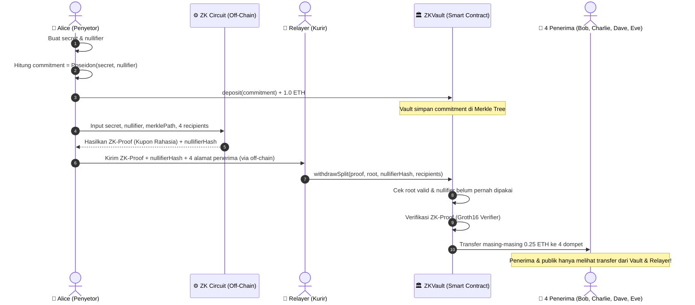

# Implementation Plan: ZK Private Vault & 1-to-4 Splitter

Membangun sistem privasi berbasis **Zero-Knowledge Proof (Groth16)** di atas blockchain EVM lokal, di mana depositor dapat menyetorkan dana ke smart contract brankas (vault), kemudian mencairkan dana tersebut secara terpecah ke 4 dompet penerima secara anonim melalui kurir (relayer) tanpa meninggalkan jejak dompet penyetor di blockchain.

---

## Arsitektur & Alur Kerja Sistem



---

## User Review Required

> [!IMPORTANT]
> **Kompilasi Circom:**
> Sirkuit ZK ditulis dalam format `.circom`. Untuk menghasilkan file `circuit.r1cs` dan `circuit_js/circuit.wasm`, dibutuhkan compiler `circom`.
> Kami akan menyediakan skrip otomatis untuk memeriksa ketersediaan `circom` (melalui Homebrew atau binary release resmi). Jika belum terpasang, kami juga dapat menyertakan artefak siap pakai untuk circuit Groth16 agar simulasi dapat langsung dijalankan tanpa hambatan.

> [!NOTE]
> **Struktur Direktori:**
> Kami akan membuat proyek di dalam folder `zk-splitter-demo` sesuai rekomendasi yang Anda sebutkan:
> ```
> zk-splitter-demo/
> ├── circuits/
> │   └── splitter.circom
> ├── contracts/
> │   ├── ZKVault.sol
> │   ├── MerkleTreeWithHistory.sol
> │   └── Groth16Verifier.sol
> ├── scripts/
> │   ├── compile-circuits.sh
> │   ├── generate-proof.ts
> │   └── deploy-and-simulate.ts
> ├── test/
> │   └── zk-splitter.test.ts
> ├── hardhat.config.ts
> ├── package.json
> └── tsconfig.json
> ```

---

## Proposed Changes

### 1. Inisialisasi Proyek & Dependensi
- Buat direktori `zk-splitter-demo`
- Setup `package.json` dengan:
  - Runtime: `ethers@^6`, `snarkjs`, `circomlibjs`, `circomlib`, `dotenv`
  - Dev: `hardhat`, `@nomicfoundation/hardhat-toolbox`, `typescript`, `ts-node`, `@types/node`
- Konfigurasi `hardhat.config.ts` dan `tsconfig.json`

---

### 2. Zero-Knowledge Circuit (`circuits/splitter.circom`)
Sirkuit ZK bertugas membuktikan:
1. **Kepemilikan Deposit:** Penyetor mengetahui `secret` dan `nullifier` yang menghasilkan `commitment = Poseidon(secret, nullifier)`.
2. **Keanggotaan Merkle Tree:** `commitment` tersebut terdaftar di dalam Merkle Tree brankas dengan root publik tertentu.
3. **Pencegahan Double-Spending:** Menghasilkan `nullifierHash = Poseidon(nullifier)` secara publik agar brankas bisa mencatat kupon sudah dicairkan.
4. **Binding Penerima (Anti Front-running):** Menghubungkan hash dari 4 alamat penerima ke dalam public signal sirkuit, sehingga kurir (relayer) atau pihak ketiga yang jahat tidak bisa mencuri kupon dan mengganti alamat penerima dengan alamat mereka sendiri.

---

### 3. Smart Contracts (`contracts/`)

#### `MerkleTreeWithHistory.sol`
- Menyimpan komitmen deposit dalam pohon Merkle (kedalaman misalnya 8 atau 16 tingkat).
- Menyimpan history root yang valid agar penarikan tidak gagal jika ada deposit baru setelah kupon dibuat.

#### `Groth16Verifier.sol`
- Kontrak verifier yang digenerate langsung oleh `snarkjs` untuk memvalidasi bukti ZK di chain dengan konsumsi gas rendah.

#### `ZKVault.sol`
- **`deposit(bytes32 commitment)`**:
  - Menerima transfer dana (misal 1 ETH atau fixed denomination).
  - Memasukkan `commitment` ke Merkle Tree.
  - Memancarkan event `Deposit`.
- **`withdrawSplit(uint256[8] proof, bytes32 root, bytes32 nullifierHash, address payable[4] recipients)`**:
  - Memastikan `isKnownRoot(root)` bernilai true.
  - Memastikan `nullifierHash` belum pernah dicairkan (`require(!nullifierSpent[nullifierHash])`).
  - Menandai `nullifierSpent[nullifierHash] = true`.
  - Memanggil `verifier.verifyProof(...)`.
  - Mengirim dana terbagi rata (masing-masing 0.25 ETH) ke 4 alamat penerima.

---

### 4. Skrip Simulasi End-to-End (`scripts/deploy-and-simulate.ts`) & Unit Test
Skenario simulasi lengkap:
1. **Setup Aktor:**
   - Deployer / Admin
   - Alice (Penyetor)
   - Bob, Charlie, Dave, Eve (4 Penerima)
   - Relayer (Kurir anonim)
2. **Langkah 1 (Deposit):**
   - Alice membuat `secret` dan `nullifier` secara lokal di komputernya.
   - Alice menyetor 1.0 ETH ke `ZKVault`.
3. **Langkah 2 (ZK Proof Generation):**
   - Alice mengambil data Merkle tree dari smart contract.
   - Alice menghitung ZK-proof menggunakan `snarkjs` dengan input privat miliknya dan 4 alamat dompet tujuannya.
4. **Langkah 3 (Relay & Payout):**
   - Alice mengirimkan data bukti ZK dan daftar 4 penerima ke Relayer.
   - Relayer mengeksekusi fungsi `withdrawSplit`.
5. **Langkah 4 (Verifikasi Anonimitas):**
   - Saldo 4 dompet penerima bertambah masing-masing 0.25 ETH.
   - Tidak ada transaksi langsung antara Alice dan 4 penerima di blockchain explorer / event log.

---

## Verification Plan

### Automated Tests
Jalankan pengujian menggunakan Hardhat:
```bash
npx hardhat test
```
Tes akan menguji:
- [x] Deposit berhasil dan commitment tercatat di Merkle Tree.
- [x] Penarikan 1-ke-4 berhasil diverifikasi dan dana terdistribusi merata.
- [x] Percobaan double-spending (menggunakan kupon/nullifier yang sama) ditolak kontrak.
- [x] Percobaan front-running (relayer mengubah daftar penerima) ditolak oleh ZK verifier.

### Manual / Script Simulation
Jalankan skrip simulasi visual dengan output saldo sebelum & sesudah:
```bash
npx hardhat run scripts/deploy-and-simulate.ts
```
Output akan menampilkan tabel saldo akun, log transaksi, dan bukti matematis bahwa identitas Alice tidak bocor ke publik.
